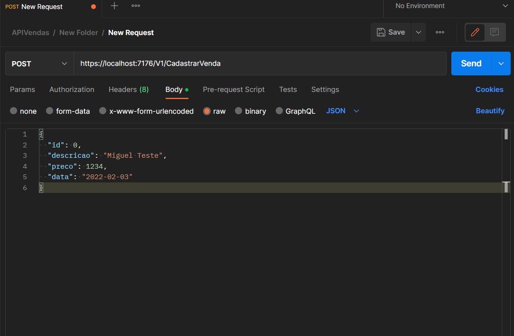
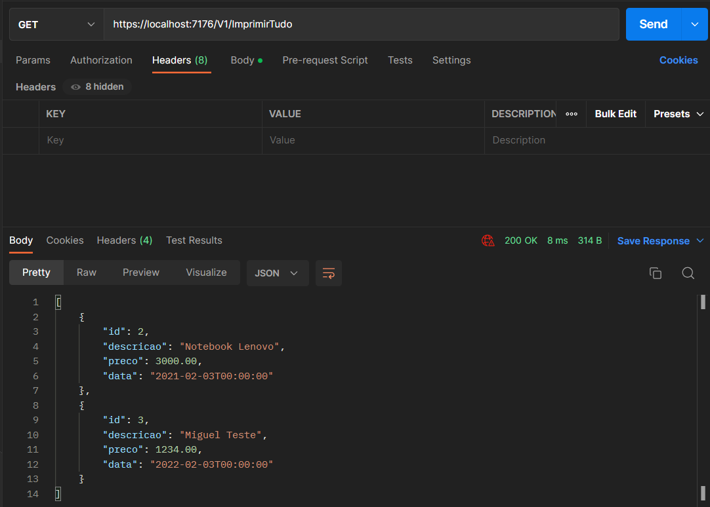
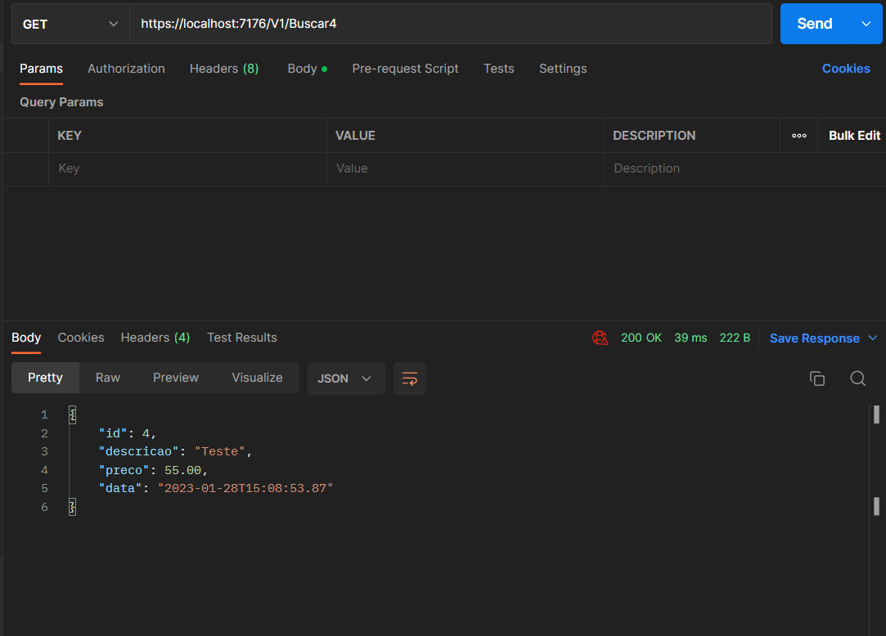
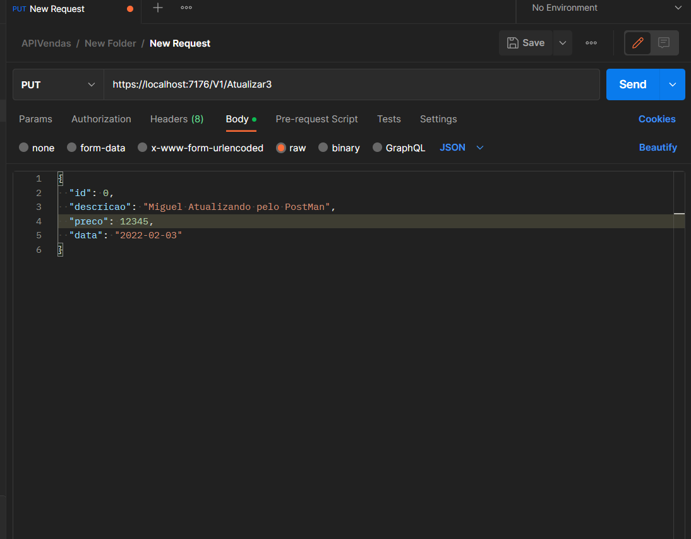
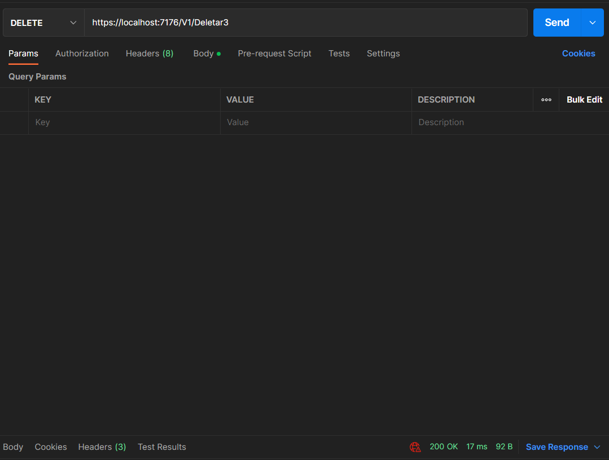

# API REST com CRUD feita em C#


API REST com CRUD usando os seguintes métodos HTTP: POST, GET, PUT e DELETE.

## Índice
- <a href="#Tecnologias utilizadas">Tecnologias utilizadas no Projeto</a>
- <a href="#Imagens de testes com o PostMan">Imagens dos testes</a>


## 🛠️ Tecnologias utilizadas 
1. [.NET](https://dotnet.microsoft.com/pt-br/)
2. [Microsoft Entity Framework Core](https://www.nuget.org/packages/Microsoft.EntityFrameworkCore)
3. [ASP.NET Core](https://dotnet.microsoft.com/pt-br/apps/aspnet) 
4. [Microsoft SQL Server Express](https://www.microsoft.com/pt-br/sql-server/sql-server-downloads)


## 📷 Imagens de testes com o PostMan
- Teste POST

- Endpoint Cadastro: https://localhost:7176/V1/CadastrarVenda 

- Corpo para criação: 
{
  "id": 0,
  "descricao": "string",
  "preco": 0,
  "data": "2023-01-28T15:06:11.740Z"
}
-----------------------------


- Teste GET ALL

- Endpoint: https://localhost:7176/V1/ImprimirTudo

-----------------------------


- Teste GET com ID:

- Endpoint: https://localhost:7176/V1/Buscar{id} (Substituir as chaves e colocar o id no local)




- Teste PUT
- Endpoint: https://localhost:7176/V1/Atualizar{id} (Substituir as chaves e colocar o id no local)

-----------------------------



- Teste DELETE
-----------------------------



## 🚀 Como rodar esse projeto ?

``` bash

# Execute o SQL Server

# Clone este repositório 
$ git clone https://github.com/MiguelFarias1/Api-Vendas.git

# Entre na pasta do projeto
$ cd ApiVendas

# Execute o comando restore
$ dotnet restore

# Instale o Entity Framework

$ dotnet tool install --global dotnet-ef

# Instale os pacotes abaixo

$ dotnet add package Microsoft.EntityFrameworkCore.SqlServer 

$ dotnet add package Microsoft.EntityFrameworkCore.Services

$ dotnet add package Microsoft.EntityFrameworkCore.Design

# Inicialize o Banco de Dados
$ dotnet ef add Migrations ApiVendas

# Atualize o Banco de Dados
$ dotnet ef database update

# Execute a aplicação
$ dotnet watch run

```
