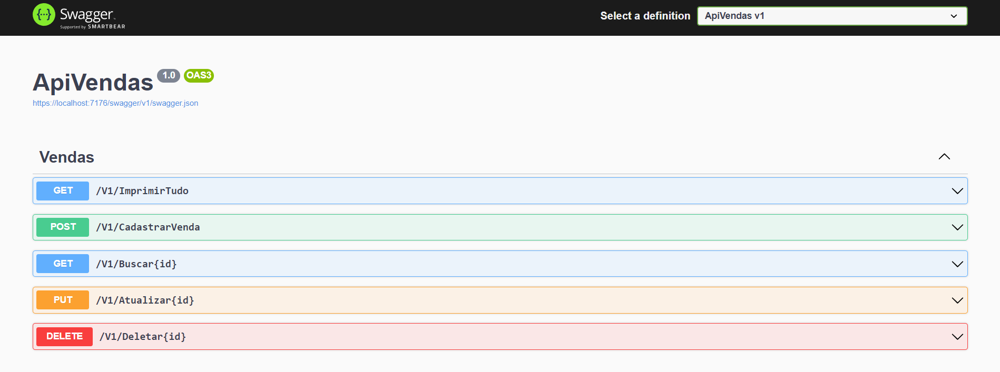

# API REST com CRUD feita em C#



API REST com CRUD usando os seguintes métodos HTTP: POST, GET, PUT e DELETE.

## Índice
- <a href="#Tecnologias utilizadas">Tecnologias utilizadas no Projeto</a>


## 🛠️ Tecnologias utilizadas 
1. [.NET](https://dotnet.microsoft.com/pt-br/)
2. [Microsoft Entity Framework Core](https://www.nuget.org/packages/Microsoft.EntityFrameworkCore)
3. [ASP.NET Core](https://dotnet.microsoft.com/pt-br/apps/aspnet) 
4. [Microsoft SQL Server Express](https://www.microsoft.com/pt-br/sql-server/sql-server-downloads)


## 🚀 Como rodar esse projeto ?

``` bash

# Execute o SQL Server

# Clone este repositório 
$ git clone https://github.com/MiguelFarias1/Api-Vendas.git

# Entre na pasta do projeto
$ cd ApiVendas

# Execute o comando restore
$ dotnet restore

# Instale os pacotes
$ dotnet add package Microsoft.EntityFrameworkCore.SqlServer 

$ dotnet add package Microsoft.EntityFrameworkCore.Services

$ dotnet add package Microsoft.EntityFrameworkCore.Design

# Execute a aplicação
$ dotnet watch run

```
